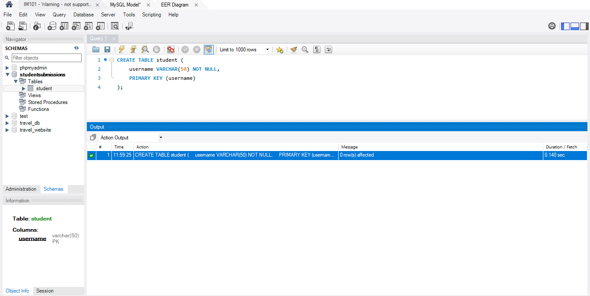
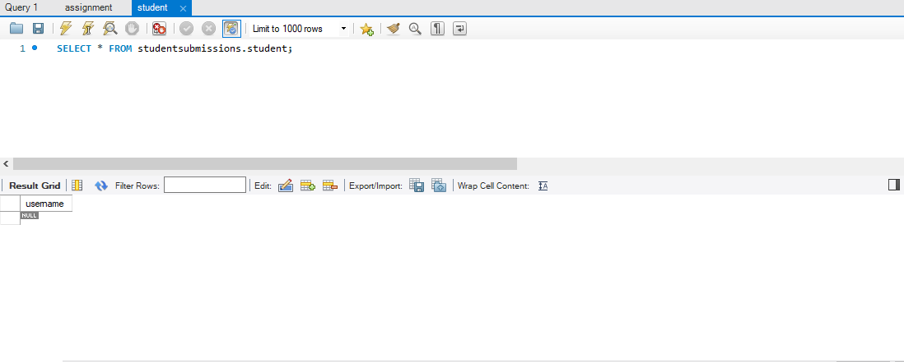
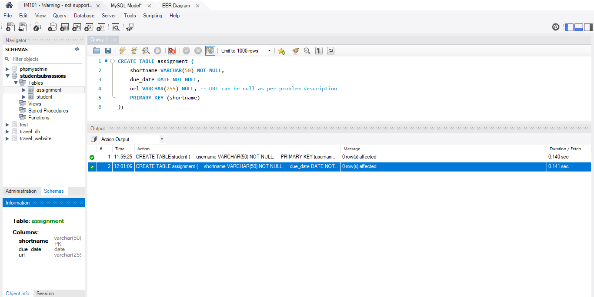
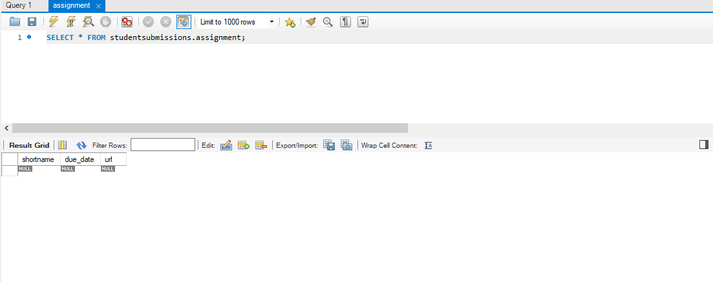
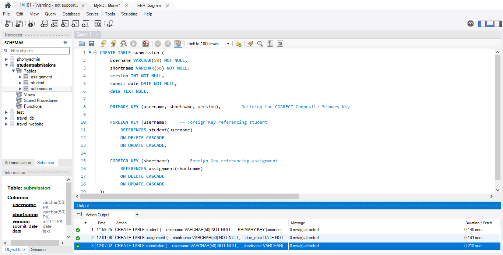
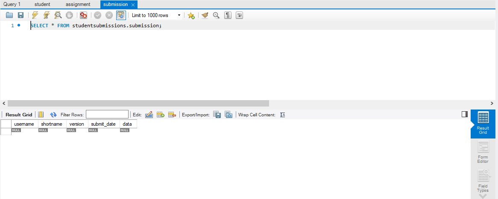

# IM101_Finals_Lab_Task_4
Converting ER Diagram to MySQL Tables

Manicdao, Kevin Kyle Jr. C
Salisi, Micaella P. 

## 1. SQL Statements (Table Creation & Relationships)

This section fulfills the requirement for posting the SQL statements. The complete schema is also available in the exported file: **Manicdao_KK_Salisi_M-Finals Lab Task 4. Converting an ER into Mysql Database**

Here are the CREATE TABLE statements with Primary and Foreign Key constraints:

-- STUDENT Table
CREATE TABLE `student` (
  `username` varchar(50) NOT NULL,
  PRIMARY KEY (`username`)
) ENGINE=InnoDB DEFAULT CHARSET=utf8mb4 COLLATE=utf8mb4_general_ci;

-- ASSIGNMENT Table
CREATE TABLE `assignment` (
  `shortname` varchar(50) NOT NULL,
  `due_date` date NOT NULL,
  `url` varchar(255) DEFAULT NULL,
  PRIMARY KEY (`shortname`)
) ENGINE=InnoDB DEFAULT CHARSET=utf8mb4 COLLATE=utf8mb4_general_ci;

-- SUBMISSION Table (Includes Composite PK and FKs)
CREATE TABLE `submission` (
  `username` varchar(50) NOT NULL,
  `shortname` varchar(50) NOT NULL,
  `version` int(11) NOT NULL,
  `submit_date` date NOT NULL,
  `data` text DEFAULT NULL,
  PRIMARY KEY (`username`,`shortname`,`version`),
  KEY `shortname` (`shortname`),
  CONSTRAINT `submission_ibfk_1` FOREIGN KEY (`username`) REFERENCES `student` (`username`) ON DELETE CASCADE ON UPDATE CASCADE,
  CONSTRAINT `submission_ibfk_2` FOREIGN KEY (`shortname`) REFERENCES `assignment` (`shortname`) ON DELETE CASCADE ON UPDATE CASCADE
) ENGINE=InnoDB DEFAULT CHARSET=utf8mb4 COLLATE=utf8mb4_general_ci;

---

## 2. Table Structure and Creation Screenshots

### 2.1. Student Table
| SQL Statement | Empty Table Structure |
| :---: | :---: |
|  |  |

### 2.2. Assignment Table
| SQL Statement | Empty Table Structure |
| :---: | :---: |
|  |  |

### 2.3. Submission Table
| SQL Statement | Empty Table Structure |
| :---: | :---: |
|  |  |

---

## 3. Relational Schema (EER Diagram)

The visual representation of the final relational schema from the EER tool:

---

## 4. SQL Copy of the Database

The complete database structure has been exported to the following file, fulfilling Requirement 4:

[Manicdao_KK_Salisi_M-Finals Lab Task 4. Converting an ER into Mysql Database](Manicdao_KK_Salisi_M-Finals Lab Task 4. Converting an ER into Mysql Database.sql)

---
